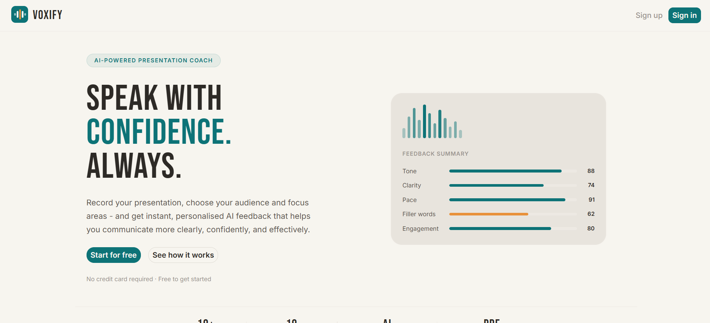
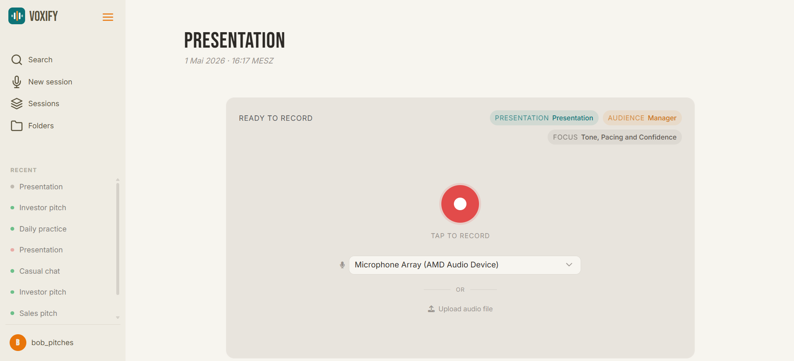
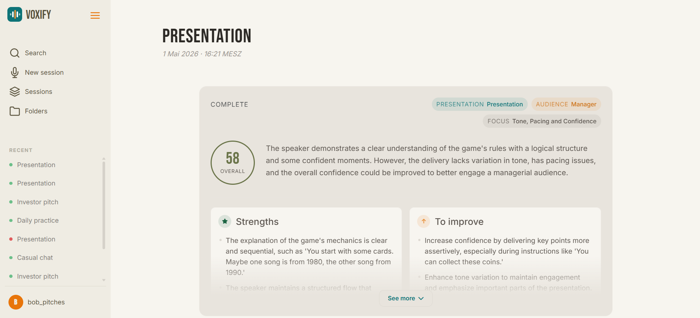
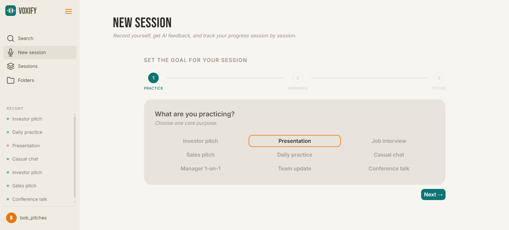
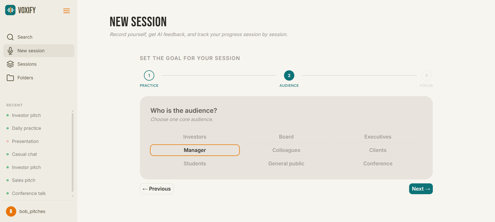
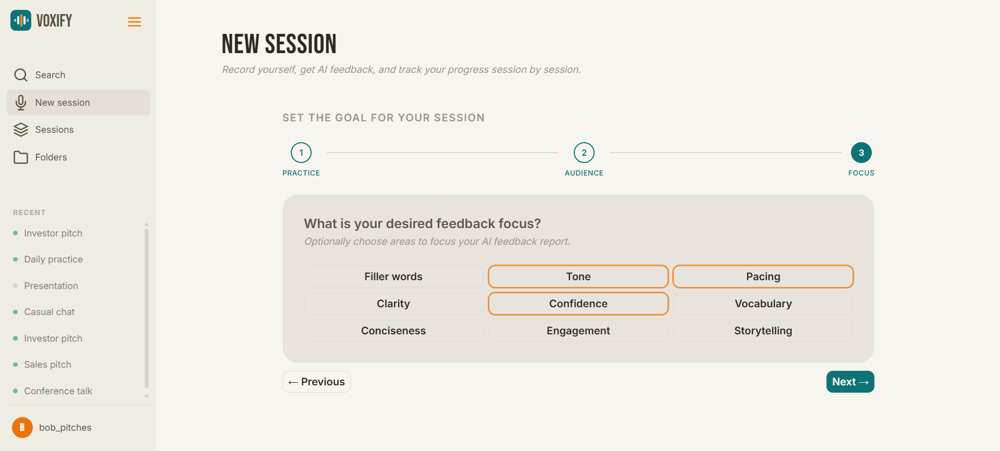
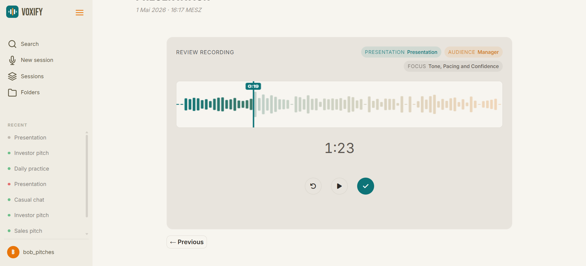

<!--
  README TEMPLATE
  ===============
  Two kinds of sections in this file:

  1. Sections marked with <!-- FILL MANUALLY: ... --> are for YOU to write.
     They contain personal, project-specific content only you can provide.

  2. Sections marked with <!-- FILL VIA CLAUDE CODE --> are populated by
     Claude Code based on actual analysis of the codebase. Do not edit
     these by hand before running the prompt.

  Delete every HTML comment block (including this one) once the README
  is finalized.
-->

# Voxify

> <!-- FILL MANUALLY: One or two sentences describing what this project does and who it is for. Mention the context (bootcamp project, personal project, hackathon, etc.) if relevant. -->
AI-powered presentation coach built in a team of three as a bootcamp project. Record yourself, receive relevant and individual feedback and improve your presentation skills.

📂 **Repository:** https://github.com/Robert-w1/voxify/

<!-- FILL MANUALLY: Add badges here once CI is set up. Example:


-->

---

## 📸 Preview





---

## 📑 Table of Contents

- [Features](#features)
- [Tech Stack](#tech-stack)
- [Architecture](#architecture)
- [Installation & Setup](#installation--setup)
- [Usage](#usage)
- [Tests](#tests)
- [My Contribution](#my-contribution)
- [Known Limitations](#known-limitations)
- [Planned Improvements](#planned-improvements)
- [License](#license)

---

## ✨ Features

- 🔐 User registration und sign in with secure password encryption (bcrypt)
- 👥 Choose practice purpose, audience and feedback areas
- 🎙️->📊 Record yourself and get comprehensive AI-powered feedback on multiple dimensions
- 📝 Download PDF report containing your a transcription of your recording and whole feedback
- 📂 Organize your recordings in project folders
- 🔍 Full-text search by session or folder

---

## 🛠 Tech Stack

### Backend
| Library | Version |
|---|---|
| Ruby | 3.3.5 |
| Rails | 7.2.3.1 |
| PostgreSQL (`pg`) | 1.6.3 |
| Puma | 7.2.0 |
| Devise | 5.0.3 |
| pg_search | 2.3.7 |
| Prawn (PDF generation) | 2.4.0 |

### Frontend
| Library | Version |
|---|---|
| Bootstrap | 5.3.8 |
| Hotwire Turbo | 2.0.23 |
| Hotwire Stimulus | 1.3.4 |
| Importmap | 2.2.3 |
| Font Awesome | 6.7.2 |
| simple_form | 5.4.1 |

### External APIs
| Service | Purpose | Integration |
|---|---|---|
| Deepgram | Speech-to-text transcription | REST via `Net::HTTP` |
| Azure GitHub Models (via RubyLLM 1.2.0) | LLM feedback generation | `ruby_llm` gem |
| Cloudinary | File storage (production) | `cloudinary` gem 2.4.4 |

### Tooling & Deployment
| Tool | Version |
|---|---|
| RuboCop (+ rails, performance, minitest, capybara plugins) | 1.86.1 |
| ESLint | 9.x |
| Prettier | 3.8.3 |
| Stylelint | 17.9.1 |
| Brakeman | 8.0.4 |
| bundler-audit | 0.9.3 |
| Jest | 29.x |
| Docker | multi-stage build (ruby:3.3.5-slim) |
| GitHub Actions | CI |

---

## 🏗 Architecture

Voxify is a server-rendered Rails monolith. Audio is captured in the browser via the MediaRecorder API and uploaded directly to the server. Processing then runs through a three-stage **Active Job pipeline**: transcription → AI analysis → PDF generation. There is no client-side bundler — JavaScript is loaded via Importmap.

```
Browser (Stimulus + MediaRecorder)
        │  POST /sessions/:id/recordings (FormData)
        ▼
RecordingsController
        │  attaches audio via Active Storage → Cloudinary (production)
        ▼
TranscribeRecordingJob
        │  sends audio to Deepgram REST API, stores transcript on Recording
        ▼
AnalyzeTranscriptJob
        │  sends transcript to Azure GitHub Models via RubyLLM gem
        │  stores structured JSON feedback on Report (JSONB columns)
        ▼
GenerateReportPdfJob
        │  PdfReportService builds PDF with Prawn
        └─ PDF stored via Active Storage
```

**Non-obvious choices:**
- `focus` is a PostgreSQL `text[]` array column, not a join table.
- `Report` stores all LLM output in three JSONB columns (`summary`, `focus_feedbacks`, `llm_raw_response`) — no separate feedback rows.
- Full-text search (sessions + folders) uses `pg_search` against PostgreSQL, no external search service.
- The LLM integration uses `ruby_llm` pointed at `models.inference.ai.azure.com` (GitHub Models), authenticated with a GitHub token rather than a direct Anthropic key.

---

## 🚀 Installation & Setup

### Prerequisites

- **Ruby 3.3.5** — use [rbenv](https://github.com/rbenv/rbenv) or [asdf](https://asdf-vm.com/)
- **PostgreSQL 16+**
- **Node.js 20+ and npm** (for JS linting and tests)

### 1. Clone and install

```bash
git clone https://github.com/Robert-w1/voxify.git
cd voxify
bundle install
npm install
```

### 2. Environment variables

Create a `.env` file in the project root:

```bash
DEEPGRAM_API_KEY=your_deepgram_api_key
GITHUB_TOKEN=your_github_token        # authenticates the Azure GitHub Models Inference API
CLOUDINARY_URL=cloudinary://...       # file storage (required in production)
```

<!-- TODO: add a .env.example file to the repository so contributors know which variables are required -->

### 3. Database

```bash
rails db:create db:migrate
```

### 4. Start the development server

<!-- TODO: verify the correct dev server command — bin/dev and Procfile.dev are documented in CLAUDE.md but the files do not exist in the repository -->

```bash
rails server
```

The app will be available at **http://localhost:3000**.

---

## 🎯 Usage

1. After sign in you start a new session
2. Choose your core purpose

3. Choose your audience

4. Optional: choose feedback focus

5. Start your recording

6. Optional: listen to your recording or re-do

7. Get your individual AI-powered feedback


---

## 🧪 Tests

**Frameworks:** Minitest (Rails default) for backend, Jest 29 for JavaScript, Capybara + Selenium WebDriver (Chrome) for system tests.

| Category | Location |
|---|---|
| Model tests | `test/models/` |
| Controller tests | `test/controllers/` |
| Job tests | `test/jobs/` |
| System tests (browser) | `test/system/` |
| JavaScript unit tests | `test/javascript/` |

```bash
# All Rails tests (models, controllers, jobs)
rails test

# Single file
rails test test/models/recording_session_test.rb

# System tests — requires Chrome installed
rails test:system

# JavaScript tests
npm test
```

External API calls (Deepgram, RubyLLM) are stubbed inline using `Minitest::Mock`. No WebMock or VCR cassettes are used.

---

## 🧹 Code Quality

| Tool | Scope | Commands |
|---|---|---|
| RuboCop (+ rails, performance, minitest, capybara) | Ruby | `bundle exec rubocop` / `bundle exec rubocop -a` |
| ESLint + Prettier | JavaScript (`app/javascript/`) | `npm run lint` / `npm run lint:fix` |
| Stylelint | SCSS (`app/assets/stylesheets/`) | `npm run lint:css` / `npm run lint:css:fix` |
| Brakeman | Ruby static security analysis | `bundle exec brakeman --no-pager` |
| bundler-audit | Gem vulnerability check | `bundle exec bundler-audit check --update` |

All five tools run automatically in CI on every push and pull request.

## ⚙️ Continuous Integration

**Provider:** GitHub Actions (`.github/workflows/ci.yml`)
**Triggers:** push to `master`, all pull requests

| Job | What it does |
|---|---|
| `lint-ruby` | Runs RuboCop |
| `lint-frontend` | Runs ESLint and Stylelint |
| `test-js` | Runs Jest unit tests |
| `security` | Runs Brakeman and bundler-audit |
| `test-unit` | Runs all Minitest tests against PostgreSQL 16 |
| `test-system` | Runs Capybara + Chrome system tests (requires `lint-ruby`, `lint-frontend`, and `test-unit` to pass first) |

---

## 👥 My Contribution

<!-- FILL MANUALLY: If this was a team project, state team size and
context. List your main areas of responsibility honestly. Optionally
add a short reflection on what you learned. If this was a solo project,
replace this section with "## 👤 About This Project" and note that it
was built solo. -->

---

## ⚠️ Known Limitations

- Only recordings in English can be processed
- Tone and pace are not currently being adequatly assessed
- If the recording is too short, the feedback can be inaccurate

---

## 🔮 Planned Improvements

- Improve feedback on tone, pace and pitch variation
- Fine-tune AI feedback

---

## 📄 License

<!-- FILL MANUALLY: State the license. Common choice for portfolio
projects is MIT. Make sure a LICENSE file actually exists in the repo. -->

---

## 📬 Contact

<!-- FILL MANUALLY: Your name, email, LinkedIn, optional portfolio URL. -->
